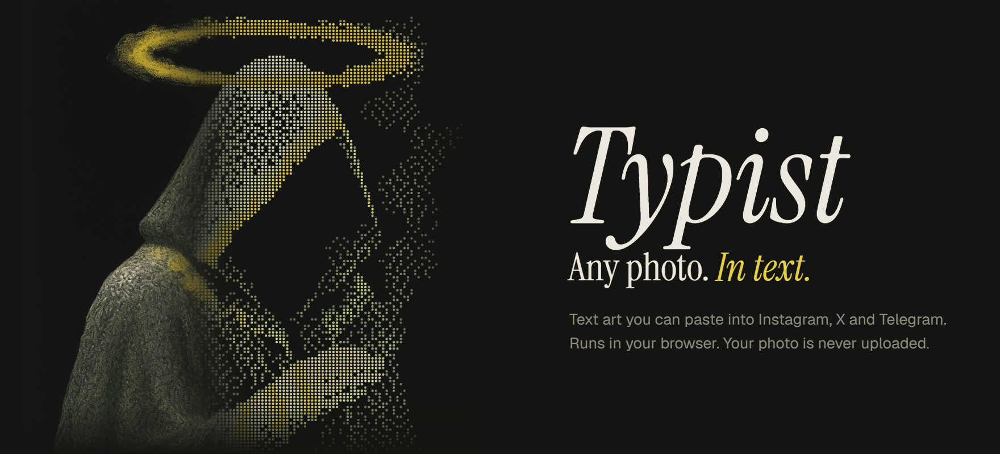
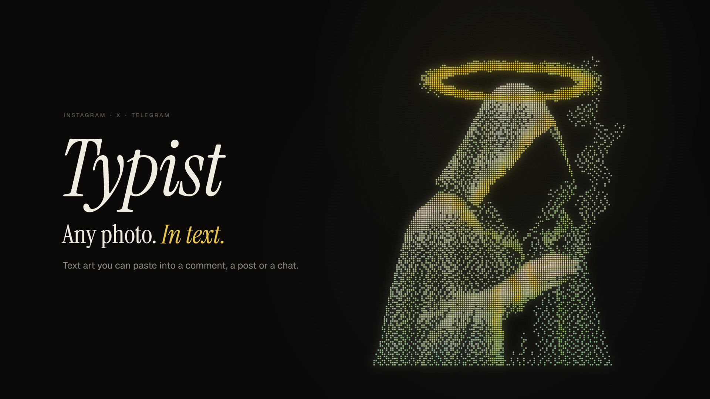
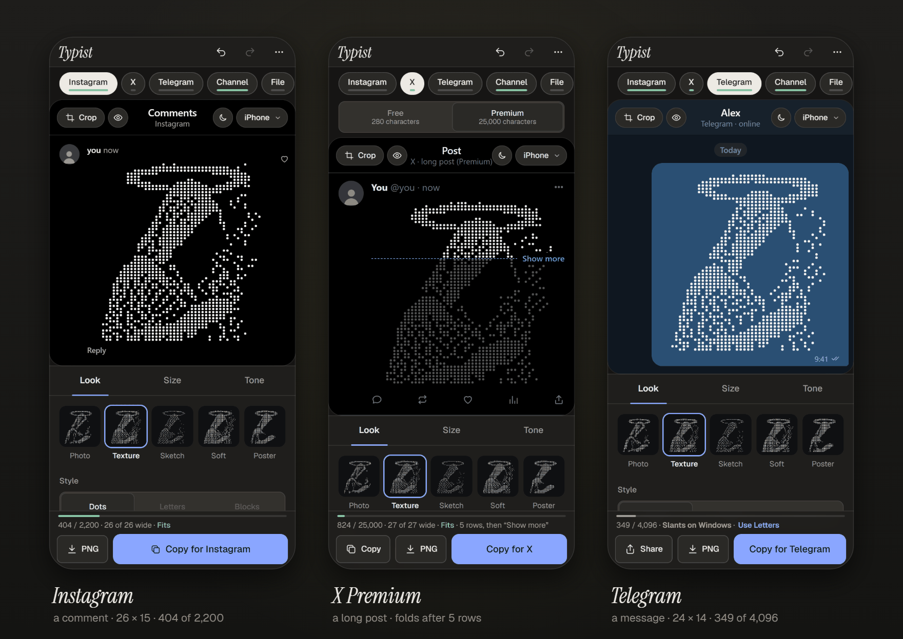
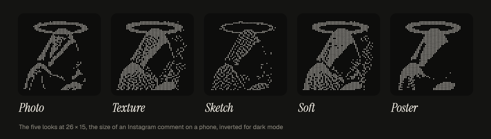
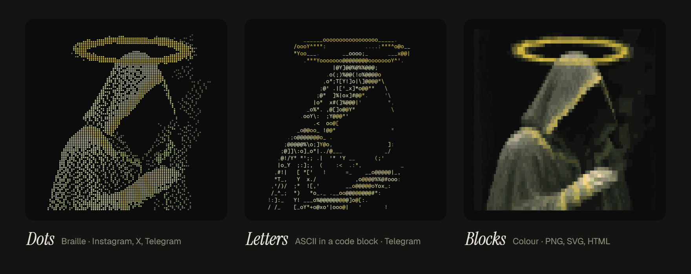
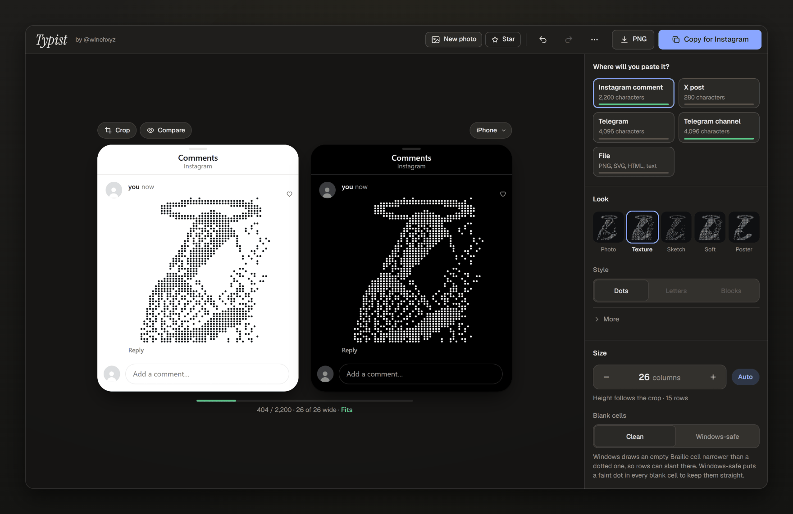

<h1 align="center">
  <a href="https://winchxyz.github.io/typist/"></a>
</h1>

<p align="center">
  Turn any photo into text art you can paste into an Instagram comment, an X post or a Telegram message.
</p>

<p align="center">
  <a href="https://winchxyz.github.io/typist/"></a>
  <a href="https://github.com/winchxyz/typist/stargazers"></a>
  <a href="LICENSE"></a>
  <a href="https://github.com/winchxyz/typist/actions/workflows/tests.yml"></a>
  
  
</p>

<p align="center">
  <a href="https://winchxyz.github.io/typist/docs/typist-intro.mp4"></a><br>
  <sub><a href="https://winchxyz.github.io/typist/docs/typist-intro.mp4">Watch the 16-second intro</a></sub>
</p>

## What it does

Typist turns a photo into a block of Braille dots, ASCII letters or colour blocks, sized for the
place you are going to paste it. Choose where it is going, choose a photo, copy. What you paste is
plain Unicode text, so it goes in as a comment, a post or a message, not as an image.

It is a static site: plain ES modules, no framework, no build step, no runtime dependencies. The
photo never leaves your device.

**Try it: [winchxyz.github.io/typist](https://winchxyz.github.io/typist/)**

<p align="center">
  
</p>

## Features

- **Made for where it goes.** Instagram comment, X post (free, 280) or X long post (Premium,
  25,000), Telegram message, Telegram channel post or photo caption, or a file. The target sets the
  style, the width and the character budget, and the art resizes to the largest grid that fits.
- **Five looks:** Photo, Texture, Sketch, Soft and Poster, shown as thumbnails of your own photo at
  the size you are making.
- **Three styles:** Dots (Braille), Letters (shape-matched ASCII) and Blocks (colour).
- **Crop:** drag, pinch or wheel to zoom, rotate; the art updates while you move.
- **Invert for dark mode:** the dots stand for the light parts, so the art reads on a dark screen.
- **Fit meter and true-size previews:** the count as the platform counts it, the columns a 390 px
  phone can show, and a chat preview drawn with the target device's own cell sizes (iPhone,
  Android, Windows), light and dark. Rows that would wrap are marked where they break.
- **One button per place:** Copy for Instagram; Post on X (opens the X composer with the art filled
  in and puts it on your clipboard too); Copy for X for a Premium long post; Copy for Telegram or
  for the channel. On Telegram, Share opens the share sheet on a phone, and on desktop Open hands
  short art to Telegram through a t.me link.
- **A PNG button on every target** (2× or 4×; on a phone it goes through the share sheet, so it can
  land in Photos). The File target adds SVG, HTML (colour blocks keep their colours) and .txt.
- Undo and redo; drop or paste a photo anywhere; desktop keys: C copy, 1 to 5 targets, [ and ]
  width, I invert, F crop, S PNG.

<p align="center">
  
</p>

<p align="center">
  
</p>

Every picture in this README is real Typist output for the showcase artwork. The art images are
drawn from the app's own modules by [dev/readme-art.html](dev/readme-art.html); the phone and
desktop pictures are screenshots of the app. Where dots and letters are coloured, the colour is
sampled from the photo at that spot. The text you paste has no colour of its own: it takes the
text colour of the app it lands in.

## Where it pastes

| Place | Limit | How it counts | Style that lines up | Notes |
| --- | --- | --- | --- | --- |
| Instagram comment | 2,200 | UTF-16 code units | Dots | 26 × 15 fits a 390 px phone (404 characters). Tall comments may fold behind "more" (not measured on phones yet). Pasting the same long comment again and again can get you a temporary Action Blocked. |
| X post | 280 | Weighted: a Braille character counts 2, a line break 1 | Dots | 15 × 8 weighs 247, the largest square picture under 280. |
| X long post (Premium) | 25,000 | Weighted, same rules | Dots | The timeline shows about the first 280, then Show more. Typist marks that fold (27 × 15 shows 5 rows). |
| Telegram message | 4,096 | UTF-16 code units | Dots, or Letters in a code block | 24 × 14 Dots on a phone. Letters only line up inside a code block: 32 wide on a phone, 72 on desktop. |
| Telegram channel | 4,096, photo caption 1,024 | UTF-16 code units | Dots, or Letters in a code block | 27 × 16 Dots (447 characters) fit a text post and a photo caption. |
| File | none | | Dots, Letters, Blocks | PNG, SVG, HTML, .txt |

**Why the blanks are U+2800.** Instagram and X set text in proportional fonts, where a space and a
letter have different widths, so ASCII art falls apart there. All Braille patterns share one width,
so Dots line up. The empty pattern U+2800 fills every blank cell because an ordinary space is
narrower, and apps trim spaces at line ends and drop empty lines. So every row has the same number
of cells, no line starts or ends with a space, line breaks are LF only, and there is no trailing
newline.

**Windows.** Windows draws Braille with Segoe UI Symbol, which makes the blank cell U+2800 narrower
than a dotted one (0.651 em against 0.753 em). Rows with blanks shift left, so Dots slant in
Telegram Desktop and in X or Instagram in a Windows browser. It is the font, not the text: the
characters are intact, and phones use other Braille fonts. Two fixes in the app: set Blank cells
to **Windows-safe** (U+2840, a faint dot in each blank cell keeps the rows straight), or on
Telegram use **Letters**, which sit in a code block and line up exactly on Windows. The Windows
preview shows the slant as it will look.

<p align="center">
  
</p>

## How it works

1. **Sample.** The square crop of the photo is resampled in plain JavaScript (summed-area tables,
   so every browser gets the same numbers) into a grid of lightness values: 2 × 4 per Braille cell,
   more per letter.
2. **Tone.** Auto levels aim for a set amount of ink, then the look shapes the tones: local tone
   mapping (Photo), CLAHE (Texture), XDoG ink lines (Sketch), plain levels (Soft) or two levels
   (Poster). Brightness, contrast, gamma, detail, edges and invert sit on top.
3. **Encode.** Dots: Atkinson dithering (or Floyd–Steinberg, ordered, threshold) decides each of
   the 8 dots in a cell. Letters: each cell gets the ASCII character whose shape matches best, not
   just the one with the right density, after Alex Harri's
   [ASCII characters are not pixels](https://alexharri.com/blog/ascii-rendering). Blocks: quadrant
   blocks with a foreground and a background colour.
4. **Format.** The grid becomes the exact text for the target: U+2800 blanks, equal rows, LF only,
   NFC, a code fence for Telegram letters. It is counted the platform's way: UTF-16 units for
   Instagram and Telegram, and a tested reimplementation of twitter-text's weighted count for X.
5. **Preview and copy.** The preview draws that text with the target device's cell sizes, so what
   fits in the preview fits on the phone. Copy puts the same text on the clipboard.

## Privacy

Everything runs in your browser. The photo is read, cropped and converted on your device and is
never uploaded. There is no server, no account and no analytics. Your settings and the last photo
stay in this browser's storage, so a reload picks up where you were. The only requests the page
makes are for its own files, the fonts from Google Fonts and the repository's star count from the
GitHub API.

## Run locally

```sh
git clone https://github.com/winchxyz/typist.git
cd typist
node dev-server.js 8860
```

Then open http://localhost:8860/. Any static file server works; `dev-server.js` only turns caching
off and adds two helpers the dev pages use to save screenshots and files into `shots/`.

## Tests

Unit and fuzz tests run in plain Node (22 in CI), with no browser, no server and no npm install:

```sh
node tests/convert.test.mjs
node tests/fuzz.test.mjs
node tests/targets.test.mjs
node tests/count.test.mjs
node tests/export.test.mjs
node tests/preview.test.mjs
node --test tests/ascii.test.mjs
```

These run on every push and pull request ([tests.yml](.github/workflows/tests.yml)).

End-to-end tests drive the real pages in Chromium, Firefox and WebKit with Playwright. They need
the dev server on port 8860 and `playwright-core` (its path is set at the top of each script):

```sh
node tests/app.e2e.mjs --browser all
node tests/copy.e2e.mjs --browser chromium
node tests/crop.e2e.mjs --browser all
node tests/intake.e2e.mjs --browser chromium
node tests/xbrowser.e2e.mjs
```

## Project layout

| Path | What is there |
| --- | --- |
| `index.html`, `css/app.css` | The app |
| `js/app.js`, `js/ui.js` | State, the editor and its panels, copy, share and download |
| `js/tone.js`, `js/convert.js`, `js/dither.js`, `js/blocks.js` | Photo to tone to grid |
| `js/ascii.js`, `js/shape-vectors.js` | Shape-matched ASCII |
| `js/count.js`, `js/targets.js` | Platform counting, per-target text, auto-fit |
| `js/preview.js`, `js/raster.js` | Chat previews, drawing a grid |
| `js/copy.js`, `js/links.js`, `js/export.js` | Clipboard, composer links, PNG / SVG / HTML / .txt |
| `js/crop.js`, `js/imageio.js`, `js/store.js`, `js/history.js` | Crop frame, photo intake, storage, undo |
| `js/samples.js`, `js/share.js` | The four sample photos; sharing Typist itself and the star count |
| `js/encoder.js`, `vendor/` | Video encoding (WebCodecs, mp4-muxer) for a film export, not wired into the app yet |
| `img/` | Sample photos and the showcase artwork |
| `dev/` | Lab pages: contact sheets, the paste-test kit, the README art |
| `tests/` | Unit, fuzz and end-to-end tests |
| `docs/` | README images and the intro video |
| `SPEC.md` | Module contracts and ground rules |

## Credits

Made by [@winchxyz](https://x.com/winchxyz). Showcase artwork by @winchxyz.

Sibling project: [Spiralist](https://github.com/winchxyz/spiralist), photos drawn as one continuous
line.

The ASCII matcher follows Alex Harri's
[ASCII characters are not pixels](https://alexharri.com/blog/ascii-rendering). Type: Instrument
Serif, Geist and Geist Mono. `vendor/mp4-muxer.mjs` is
[mp4-muxer](https://github.com/Vanilagy/mp4-muxer) by Vanilagy (MIT).

## License

[MIT](LICENSE)
